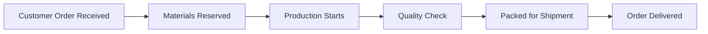
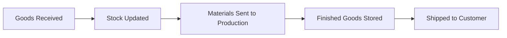
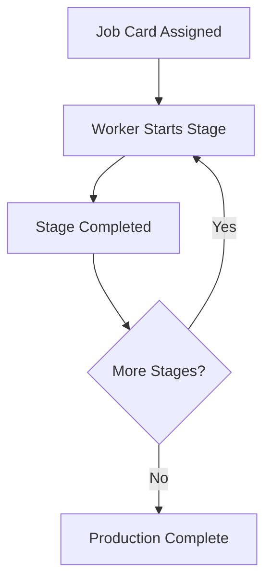
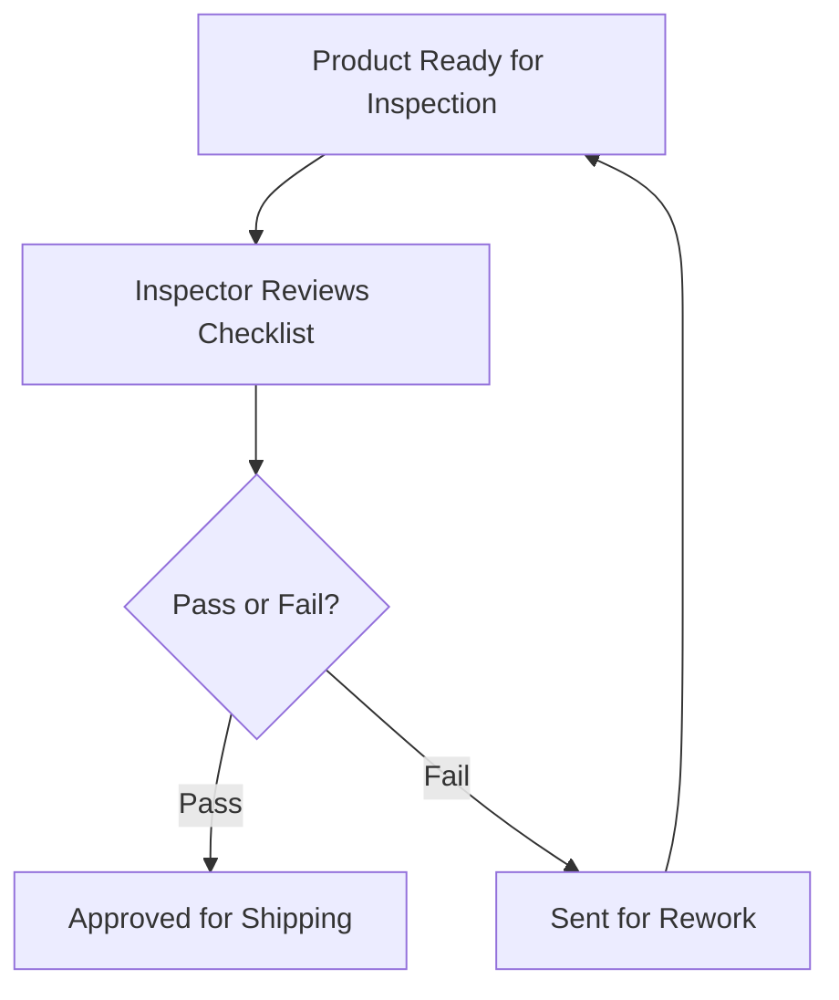
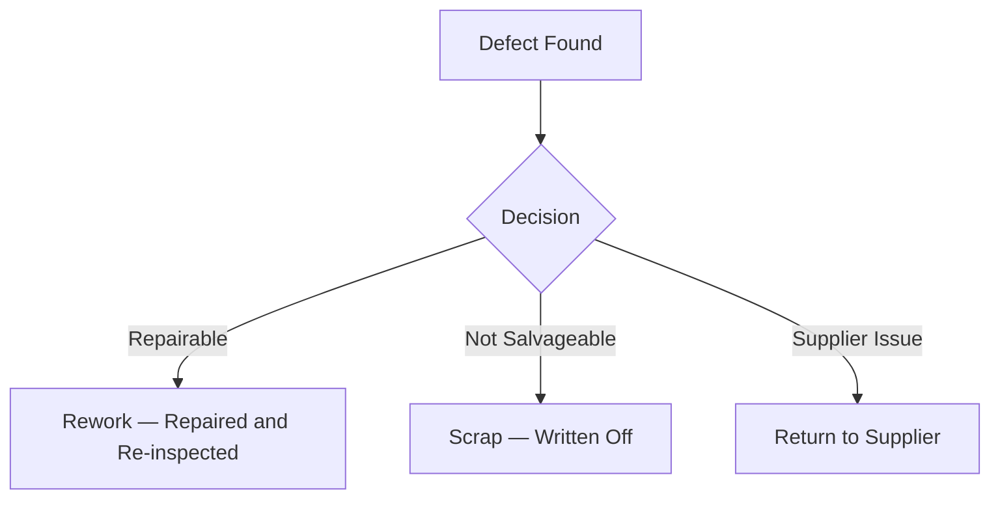
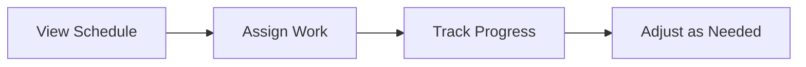
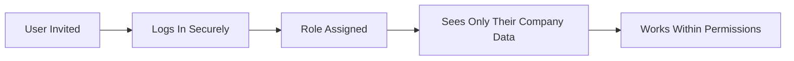
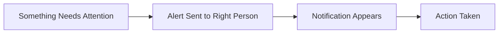

# FactoryFlow MRP — How It Works

> **Audience:** Prospects, customers, and business stakeholders.
> For implementation-level diagrams (state machines, sequence flows, API interactions), see [flowcharts.md](./flowcharts.md).

---

## Table of Contents

1. [Order to Delivery](#1-order-to-delivery)
2. [Inventory at a Glance](#2-inventory-at-a-glance)
3. [Production Tracking](#3-production-tracking)
4. [Quality Assurance](#4-quality-assurance)
5. [Scrap and Rework](#5-scrap-and-rework)
6. [Planning and Scheduling](#6-planning-and-scheduling)
7. [User Access and Security](#7-user-access-and-security)
8. [Alerts and Notifications](#8-alerts-and-notifications)

---

## 1. Order to Delivery

From the moment a customer order arrives to the moment it leaves your door, FactoryFlow tracks every step automatically.

---

## 2. Inventory at a Glance

Every movement of stock — from receiving a delivery to shipping a finished product — is recorded in real time.

---

## 3. Production Tracking

Workers know exactly what to do and when. Each stage of production is tracked as it happens, and the system loops through until the job is done.

---

## 4. Quality Assurance

Every finished product goes through a structured inspection before it can be shipped. Nothing leaves without approval.

---

## 5. Scrap and Rework

When a defect is found, the system guides your team to the right decision — fix it, write it off, or return it to the supplier.

---

## 6. Planning and Scheduling

Managers get a clear view of what needs to happen, assign work to the right people, and adjust on the fly as priorities change.

---

## 7. User Access and Security

Every person sees only what they should see. Company data is fully isolated — no cross-tenant data leakage, ever.

---

## 8. Alerts and Notifications

When something needs attention — a low-stock warning, a delayed job, a failed inspection — the right person is notified immediately.

---

*For the full technical reference including state machines, sequence diagrams, and API interaction flows, see [flowcharts.md](./flowcharts.md).*
