# FactoryFlow MRP — System Flowcharts

> **Audience**: Implementation team and operational stakeholders.
> **Renderer**: GitHub, VS Code (Mermaid extension ≥ v10), or [mermaid.live](https://mermaid.live).
> **Source files**: Status enums and business logic are drawn directly from the codebase — see inline references.

---

## Table of Contents

1. [Order Reception Flow](#1-order-reception-flow)
2. [Inventory Management Flow](#2-inventory-management-flow)
3. [Production Tracking Flow](#3-production-tracking-flow)
4. [Scrap and Rework Management](#4-scrap-and-rework-management)
5. [Quality Assurance Flow](#5-quality-assurance-flow)
6. [Planning and Scheduling](#6-planning-and-scheduling)
7. [Roles Management and RBAC](#7-roles-management-and-rbac)
8. [User Invitation Flow](#8-user-invitation-flow)
9. [Tenant Isolation](#9-tenant-isolation)
10. [Notification Flow](#10-notification-flow)
- [Appendix: Status Colour Mapping](#appendix-status-colour-mapping)

---

## 1. Order Reception Flow

### 1.1 Sales Order State Machine

Source: `lib/db/schema/orders.ts` (`purchaseOrders.status`), `lib/services/order.service.ts:validateStatusTransition()`.

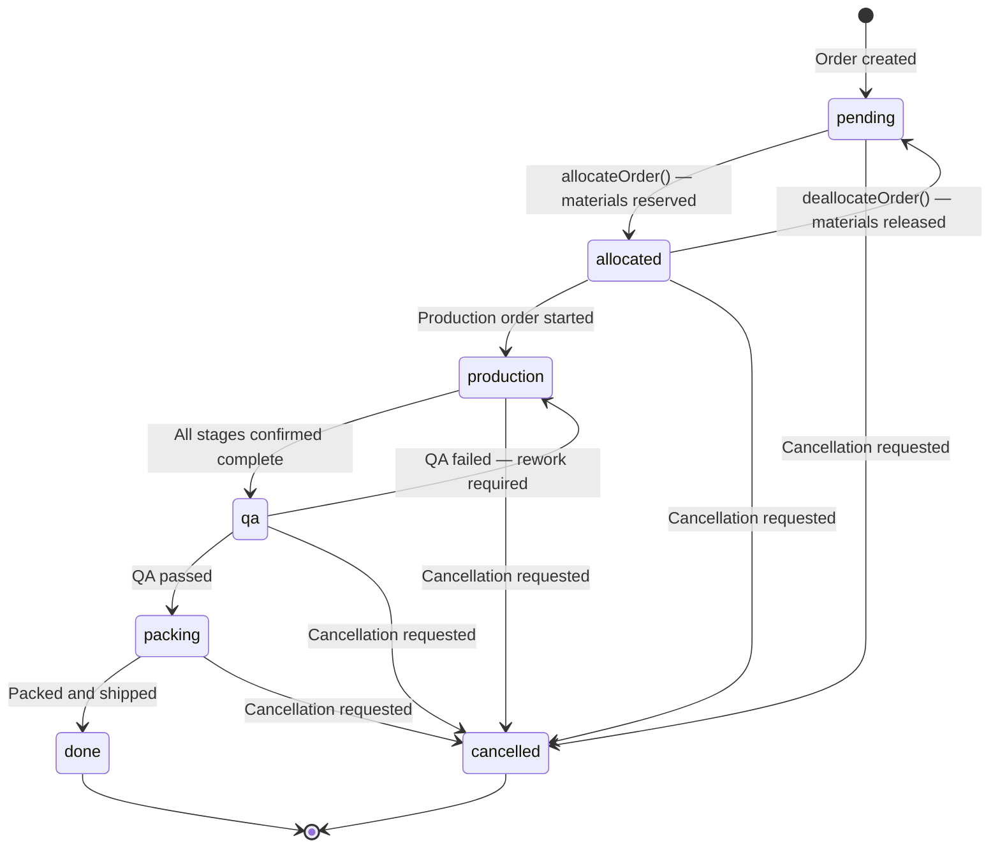
```mermaid
stateDiagram-v2
    [*] --> pending : Order created

    pending --> allocated : allocateOrder() — materials reserved
    pending --> cancelled : Cancellation requested

    allocated --> production : Production order started
    allocated --> pending : deallocateOrder() — materials released
    allocated --> cancelled : Cancellation requested

    production --> qa : All stages confirmed complete
    production --> cancelled : Cancellation requested

    qa --> packing : QA passed
    qa --> production : QA failed — rework required
    qa --> cancelled : Cancellation requested

    packing --> done : Packed and shipped
    packing --> cancelled : Cancellation requested

    done --> [*]
    cancelled --> [*]
```

---

### 1.2 Allocation Flow

Source: `OrderService.allocateOrder()` — runs inside a single DB transaction.

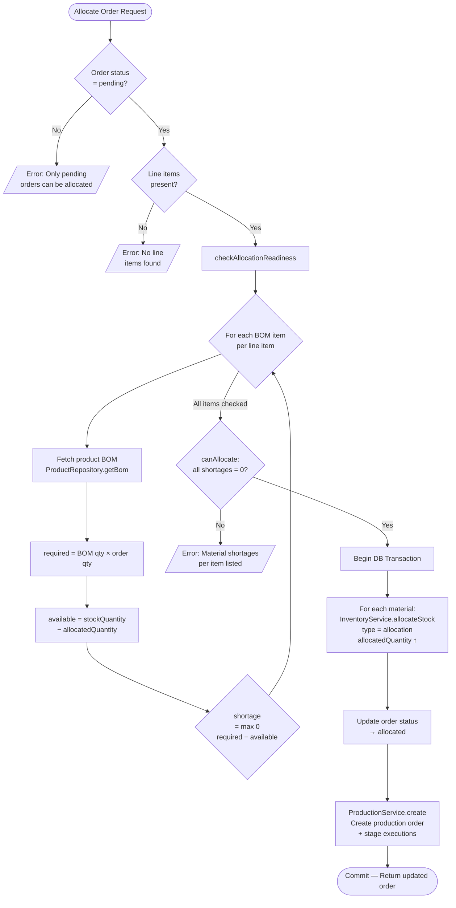
```mermaid
flowchart TD
    START([Allocate Order Request]) --> S1{Order status\n= pending?}
    S1 -- No --> E1[/Error: Only pending\norders can be allocated/]
    S1 -- Yes --> S2{Line items\npresent?}
    S2 -- No --> E2[/Error: No line\nitems found/]
    S2 -- Yes --> S3[checkAllocationReadiness]

    S3 --> LOOP{For each BOM item\nper line item}
    LOOP --> BOM1[Fetch product BOM\nProductRepository.getBom]
    BOM1 --> BOM2[required = BOM qty × order qty]
    BOM2 --> BOM3[available = stockQuantity\n− allocatedQuantity]
    BOM3 --> BOM4{shortage\n= max 0\nrequired − available}
    BOM4 --> LOOP

    LOOP -- All items checked --> CAN{canAllocate:\nall shortages = 0?}
    CAN -- No --> E3[/Error: Material shortages\nper item listed/]
    CAN -- Yes --> TXN[Begin DB Transaction]

    TXN --> ALLOC[For each material:\nInventoryService.allocateStock\ntype = allocation\nallocatedQuantity ↑]
    ALLOC --> UPORD[Update order status\n→ allocated]
    UPORD --> PROD[ProductionService.create\nCreate production order\n+ stage executions]
    PROD --> DONE([Commit — Return updated order])
```

---

### 1.3 Cancellation Flow

Source: `OrderService.updateStatus()` and `deallocateOrder()`.

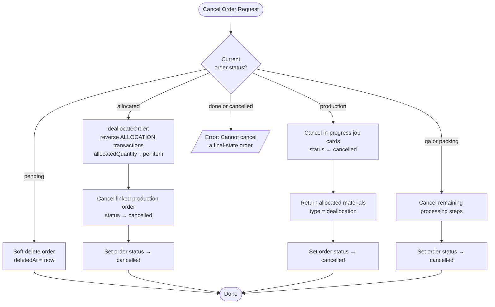
```mermaid
flowchart TD
    START([Cancel Order Request]) --> STATUS{Current\norder status?}

    STATUS -- pending --> P1[Soft-delete order\ndeletedAt = now]
    P1 --> Z([Done])

    STATUS -- allocated --> A1[deallocateOrder:\nreverse ALLOCATION transactions\nallocatedQuantity ↓ per item]
    A1 --> A2[Cancel linked production order\nstatus → cancelled]
    A2 --> A3[Set order status → cancelled]
    A3 --> Z

    STATUS -- production --> PR1[Cancel in-progress job cards\nstatus → cancelled]
    PR1 --> PR2[Return allocated materials\ntype = deallocation]
    PR2 --> PR3[Set order status → cancelled]
    PR3 --> Z

    STATUS -- qa or packing --> QP1[Cancel remaining processing steps]
    QP1 --> QP2[Set order status → cancelled]
    QP2 --> Z

    STATUS -- done or cancelled --> ERR[/Error: Cannot cancel\na final-state order/]
```

---

## 2. Inventory Management Flow

### 2.1 Stock Transaction Types Map

Source: `lib/validations/inventory.ts:inventoryTransactionTypeSchema` (current) + planning artifact FR25a (full planned set). All types outside this closed enum are rejected.

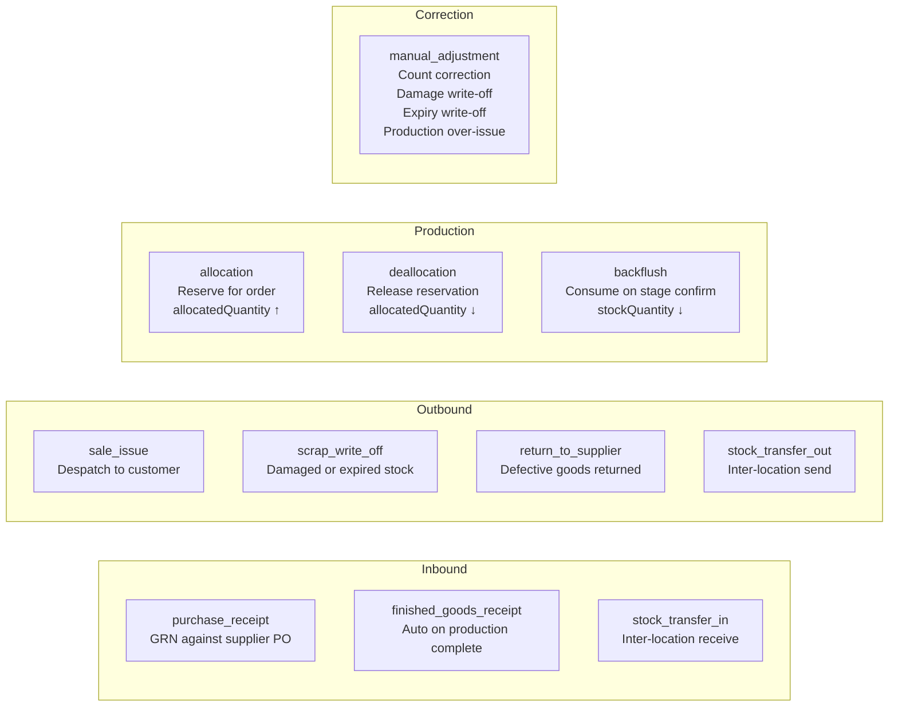
```mermaid
flowchart LR
    subgraph Inbound
        T1[purchase_receipt\nGRN against supplier PO]
        T8[finished_goods_receipt\nAuto on production complete]
        T6[stock_transfer_in\nInter-location receive]
    end

    subgraph Outbound
        T2[sale_issue\nDespatch to customer]
        T9[scrap_write_off\nDamaged or expired stock]
        T10[return_to_supplier\nDefective goods returned]
        T7[stock_transfer_out\nInter-location send]
    end

    subgraph Production
        T3[allocation\nReserve for order\nallocatedQuantity ↑]
        T4[deallocation\nRelease reservation\nallocatedQuantity ↓]
        T5[backflush\nConsume on stage confirm\nstockQuantity ↓]
    end

    subgraph Correction
        TC[manual_adjustment\nCount correction\nDamage write-off\nExpiry write-off\nProduction over-issue]
    end
```

---

### 2.2 Material Allocation → Backflush → Finished Goods Pipeline

Source: `InventoryService.allocateStock()`, `deallocateStock()` — FR22, FR23.

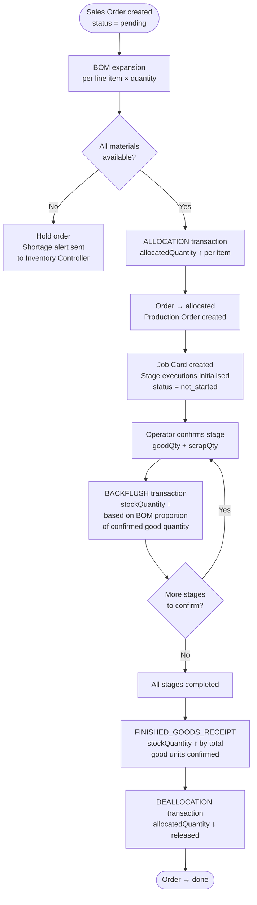
```mermaid
flowchart TD
    A([Sales Order created\nstatus = pending]) --> B[BOM expansion\nper line item × quantity]
    B --> C{All materials\navailable?}
    C -- No --> WAIT[Hold order\nShortage alert sent\nto Inventory Controller]
    C -- Yes --> D[ALLOCATION transaction\nallocatedQuantity ↑ per item]
    D --> E[Order → allocated\nProduction Order created]

    E --> F[Job Card created\nStage executions initialised\nstatus = not_started]
    F --> G[Operator confirms stage\ngoodQty + scrapQty]
    G --> H[BACKFLUSH transaction\nstockQuantity ↓\nbased on BOM proportion\nof confirmed good quantity]
    H --> I{More stages\nto confirm?}
    I -- Yes --> G
    I -- No --> J[All stages completed]

    J --> K[FINISHED_GOODS_RECEIPT\nstockQuantity ↑ by total\ngood units confirmed]
    K --> L[DEALLOCATION transaction\nallocatedQuantity ↓ released]
    L --> M([Order → done])
```

---

### 2.3 Lot Management Flow

Source: Planning artifacts FR20, FR21, FR29, FR30 — planned feature set.

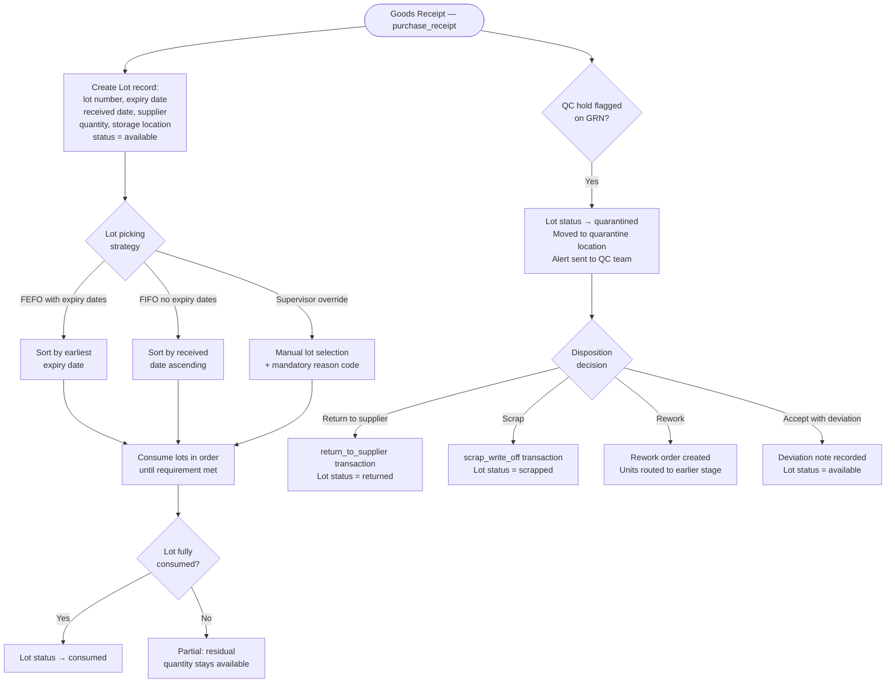
```mermaid
flowchart TD
    GRN([Goods Receipt — purchase_receipt]) --> LOT[Create Lot record:\nlot number, expiry date\nreceived date, supplier\nquantity, storage location\nstatus = available]

    LOT --> STRAT{Lot picking\nstrategy}
    STRAT -- FEFO with expiry dates --> FEFO[Sort by earliest\nexpiry date]
    STRAT -- FIFO no expiry dates --> FIFO[Sort by received\ndate ascending]
    STRAT -- Supervisor override --> OVR[Manual lot selection\n+ mandatory reason code]

    FEFO --> CONSUME[Consume lots in order\nuntil requirement met]
    FIFO --> CONSUME
    OVR --> CONSUME

    CONSUME --> FULL{Lot fully\nconsumed?}
    FULL -- Yes --> CLSD[Lot status → consumed]
    FULL -- No --> PART[Partial: residual\nquantity stays available]

    GRN --> QHOLD{QC hold flagged\non GRN?}
    QHOLD -- Yes --> QUAR[Lot status → quarantined\nMoved to quarantine location\nAlert sent to QC team]
    QUAR --> DISP{Disposition\ndecision}
    DISP -- Return to supplier --> RTS[return_to_supplier transaction\nLot status = returned]
    DISP -- Scrap --> SCRAP[scrap_write_off transaction\nLot status = scrapped]
    DISP -- Rework --> RW[Rework order created\nUnits routed to earlier stage]
    DISP -- Accept with deviation --> DEV[Deviation note recorded\nLot status = available]
```

---

### 2.4 Stock Analytics

Source: `InventoryService.enrichItemWithAnalytics()` — `lib/services/inventory.service.ts:384`.

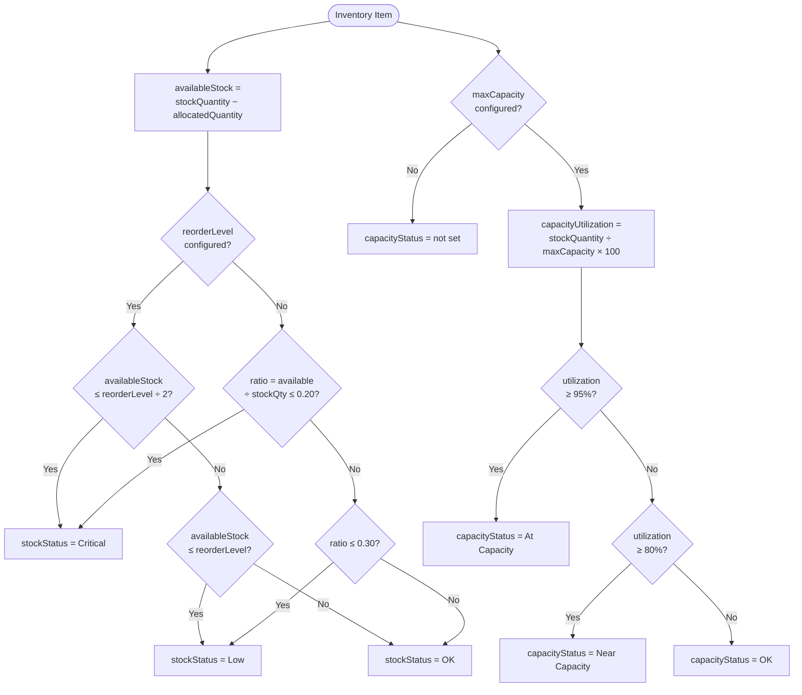
```mermaid
flowchart TD
    ITEM([Inventory Item]) --> AVAIL[availableStock =\nstockQuantity − allocatedQuantity]

    AVAIL --> RL{reorderLevel\nconfigured?}

    RL -- Yes --> RL1{availableStock\n≤ reorderLevel ÷ 2?}
    RL1 -- Yes --> SC[stockStatus = Critical]
    RL1 -- No --> RL2{availableStock\n≤ reorderLevel?}
    RL2 -- Yes --> SL[stockStatus = Low]
    RL2 -- No --> SOK[stockStatus = OK]

    RL -- No --> RAT{ratio = available\n÷ stockQty ≤ 0.20?}
    RAT -- Yes --> SC
    RAT -- No --> RAT2{ratio ≤ 0.30?}
    RAT2 -- Yes --> SL
    RAT2 -- No --> SOK

    ITEM --> MC{maxCapacity\nconfigured?}
    MC -- No --> NOCAP[capacityStatus = not set]
    MC -- Yes --> UTIL[capacityUtilization =\nstockQuantity ÷ maxCapacity × 100]
    UTIL --> C1{utilization\n≥ 95%?}
    C1 -- Yes --> CAP1[capacityStatus = At Capacity]
    C1 -- No --> C2{utilization\n≥ 80%?}
    C2 -- Yes --> CAP2[capacityStatus = Near Capacity]
    C2 -- No --> CAP3[capacityStatus = OK]
```

---

## 3. Production Tracking Flow

### 3.1 Production Order State Machine

Source: `lib/services/production.service.ts:updateProductionOrderStatusFromStages()` and `deriveOrderStatusFromStages()`.

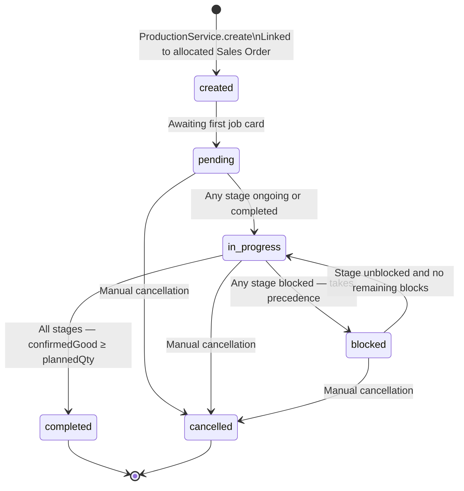
```mermaid
stateDiagram-v2
    [*] --> created : ProductionService.create\nLinked to allocated Sales Order

    created --> pending : Awaiting first job card

    pending --> in_progress : Any stage ongoing or completed

    in_progress --> blocked : Any stage blocked — takes precedence
    blocked --> in_progress : Stage unblocked and no remaining blocks

    in_progress --> completed : All stages — confirmedGood ≥ plannedQty

    pending --> cancelled : Manual cancellation
    in_progress --> cancelled : Manual cancellation
    blocked --> cancelled : Manual cancellation

    completed --> [*]
    cancelled --> [*]
```

---

### 3.2 Stage Execution State Machine

Source: `production.service.ts:deriveStageStatus()` (line 1185). Status is **derived** — never set manually. Recalculated after every confirmation insert or reversal.

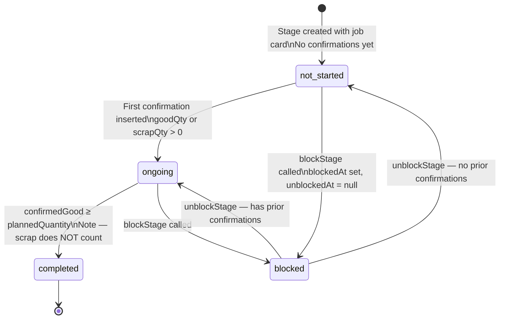
```mermaid
stateDiagram-v2
    [*] --> not_started : Stage created with job card\nNo confirmations yet

    not_started --> ongoing : First confirmation inserted\ngoodQty or scrapQty > 0

    ongoing --> completed : confirmedGood ≥ plannedQuantity\nNote — scrap does NOT count

    not_started --> blocked : blockStage called\nblockedAt set, unblockedAt = null
    ongoing --> blocked : blockStage called

    blocked --> not_started : unblockStage — no prior confirmations
    blocked --> ongoing : unblockStage — has prior confirmations

    completed --> [*]
```

---

### 3.3 Job Card State Machine

Source: `lib/db/schema/production.ts` (`jobCards.status`), `JobCardService.updateStatusFromStages()`. Status auto-derived from stage statuses. `terminated` is a manual override requiring final stage to have met target quantity.

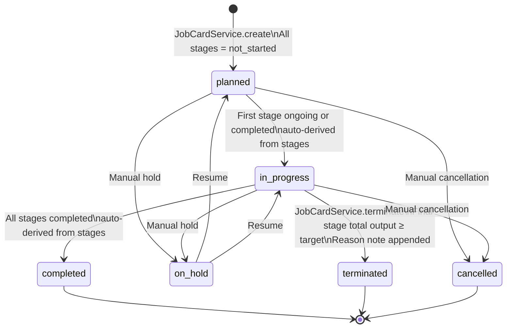
```mermaid
stateDiagram-v2
    [*] --> planned : JobCardService.create\nAll stages = not_started

    planned --> in_progress : First stage ongoing or completed\nauto-derived from stages

    in_progress --> completed : All stages completed\nauto-derived from stages

    planned --> on_hold : Manual hold
    in_progress --> on_hold : Manual hold
    on_hold --> planned : Resume
    on_hold --> in_progress : Resume

    in_progress --> terminated : JobCardService.terminate\nFinal stage total output ≥ target\nReason note appended

    planned --> cancelled : Manual cancellation
    in_progress --> cancelled : Manual cancellation

    completed --> [*]
    terminated --> [*]
    cancelled --> [*]
```

---

### 3.4 Stage Confirmation Flow

Source: `ProductionService.addConfirmation()`. Confirmations are **immutable** — no UPDATE or DELETE, only soft-reversal.

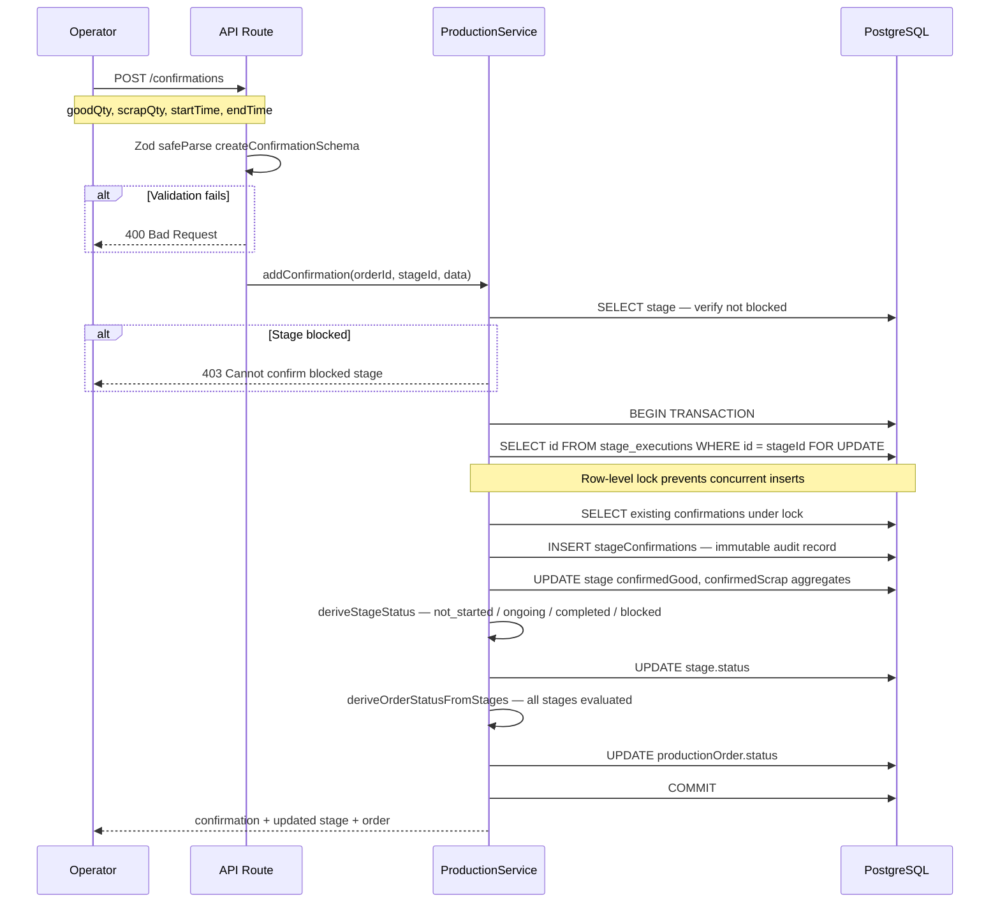
```mermaid
sequenceDiagram
    participant OP as Operator
    participant API as API Route
    participant SVC as ProductionService
    participant DB as PostgreSQL

    OP->>API: POST /confirmations
    Note over OP,API: goodQty, scrapQty, startTime, endTime

    API->>API: Zod safeParse createConfirmationSchema
    alt Validation fails
        API-->>OP: 400 Bad Request
    end

    API->>SVC: addConfirmation(orderId, stageId, data)
    SVC->>DB: SELECT stage — verify not blocked
    alt Stage blocked
        SVC-->>OP: 403 Cannot confirm blocked stage
    end

    SVC->>DB: BEGIN TRANSACTION
    SVC->>DB: SELECT id FROM stage_executions WHERE id = stageId FOR UPDATE
    Note over SVC,DB: Row-level lock prevents concurrent inserts
    SVC->>DB: SELECT existing confirmations under lock
    SVC->>DB: INSERT stageConfirmations — immutable audit record
    SVC->>DB: UPDATE stage confirmedGood, confirmedScrap aggregates
    SVC->>SVC: deriveStageStatus — not_started / ongoing / completed / blocked
    SVC->>DB: UPDATE stage.status
    SVC->>SVC: deriveOrderStatusFromStages — all stages evaluated
    SVC->>DB: UPDATE productionOrder.status
    SVC->>DB: COMMIT
    SVC-->>OP: confirmation + updated stage + order
```

---

### 3.5 Confirmation Reversal Flow

Source: `ProductionService.reverseConfirmation()`. Soft-reverse preserves the immutable audit row; `reversedBy`, `reversedAt`, `reversalReason` are stamped on the original record.

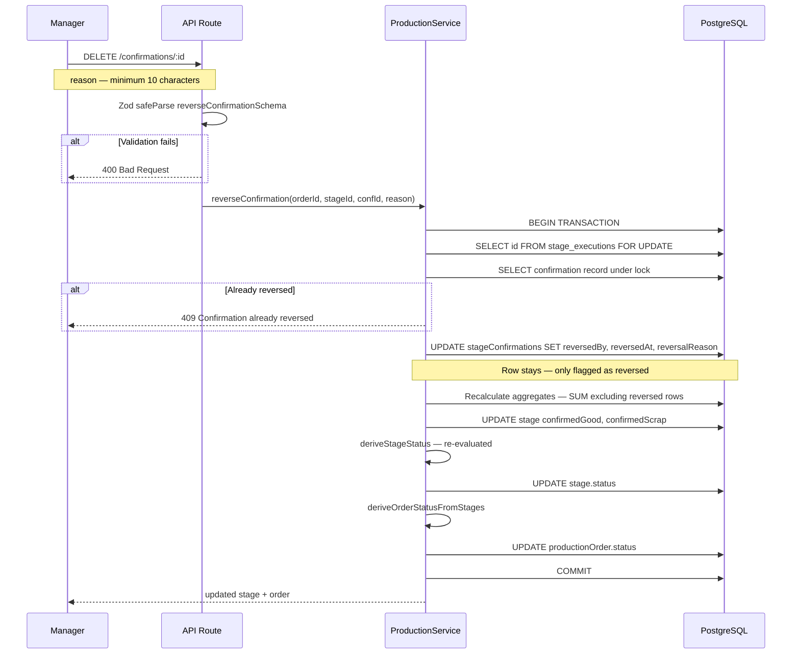
```mermaid
sequenceDiagram
    participant MGR as Manager
    participant API as API Route
    participant SVC as ProductionService
    participant DB as PostgreSQL

    MGR->>API: DELETE /confirmations/:id
    Note over MGR,API: reason — minimum 10 characters

    API->>API: Zod safeParse reverseConfirmationSchema
    alt Validation fails
        API-->>MGR: 400 Bad Request
    end

    API->>SVC: reverseConfirmation(orderId, stageId, confId, reason)
    SVC->>DB: BEGIN TRANSACTION
    SVC->>DB: SELECT id FROM stage_executions FOR UPDATE
    SVC->>DB: SELECT confirmation record under lock
    alt Already reversed
        SVC-->>MGR: 409 Confirmation already reversed
    end

    SVC->>DB: UPDATE stageConfirmations SET reversedBy, reversedAt, reversalReason
    Note over SVC,DB: Row stays — only flagged as reversed
    SVC->>DB: Recalculate aggregates — SUM excluding reversed rows
    SVC->>DB: UPDATE stage confirmedGood, confirmedScrap
    SVC->>SVC: deriveStageStatus — re-evaluated
    SVC->>DB: UPDATE stage.status
    SVC->>SVC: deriveOrderStatusFromStages
    SVC->>DB: UPDATE productionOrder.status
    SVC->>DB: COMMIT
    SVC-->>MGR: updated stage + order
```

---

### 3.6 Overall Production Workflow

End-to-end from allocated order through to completion.

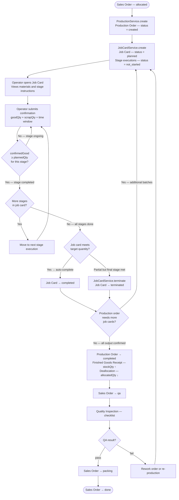
```mermaid
flowchart TD
    A([Sales Order — allocated]) --> B[ProductionService.create\nProduction Order — status = created]
    B --> C[JobCardService.create\nJob Card — status = planned\nStage executions — status = not_started]

    C --> D[Operator opens Job Card\nViews materials and stage instructions]
    D --> E[Operator submits confirmation\ngoodQty + scrapQty + time window]

    E --> F{confirmedGood\n≥ plannedQty\nfor this stage?}
    F -- No — stage ongoing --> E
    F -- Yes — stage completed --> G{More stages\nin job card?}

    G -- Yes --> H[Move to next stage execution]
    H --> E
    G -- No — all stages done --> I{Job card meets\ntarget quantity?}

    I -- Yes → auto-complete --> J[Job Card → completed]
    I -- Partial but final stage met --> K[JobCardService.terminate\nJob Card → terminated]

    J --> L{Production order\nneeds more\njob cards?}
    K --> L
    L -- Yes — additional batches --> C
    L -- No — all output confirmed --> M[Production Order → completed\nFinished Goods Receipt — stockQty ↑\nDeallocation — allocatedQty ↓]

    M --> N[Sales Order → qa]
    N --> O[Quality Inspection — checklist]
    O --> P{QA result?}
    P -- pass --> Q[Sales Order → packing]
    Q --> R([Sales Order → done])
    P -- fail --> S[Rework order or re-production]
    S --> C
```

---

## 4. Scrap and Rework Management

### 4.1 Scrap During Stage Confirmation

Source: `production.service.ts:deriveStageStatus()` — scrap explicitly excluded from completion criterion (line 1182–1184).

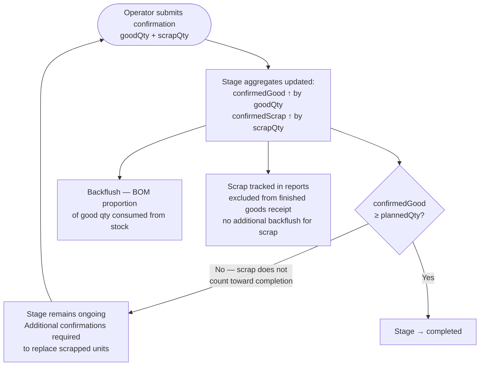
```mermaid
flowchart TD
    CONF([Operator submits confirmation\ngoodQty + scrapQty]) --> AGG[Stage aggregates updated:\nconfirmedGood ↑ by goodQty\nconfirmedScrap ↑ by scrapQty]

    AGG --> COMP{confirmedGood\n≥ plannedQty?}
    COMP -- No — scrap does not\ncount toward completion --> MORE[Stage remains ongoing\nAdditional confirmations required\nto replace scrapped units]
    MORE --> CONF
    COMP -- Yes --> DONE[Stage → completed]

    AGG --> BACK[Backflush — BOM proportion\nof good qty consumed from stock]
    AGG --> TRACK[Scrap tracked in reports\nexcluded from finished goods receipt\nno additional backflush for scrap]
```

---

### 4.2 Quarantine Disposition and Rework Flow

Source: Planning artifacts FR29, FR30, FR37.

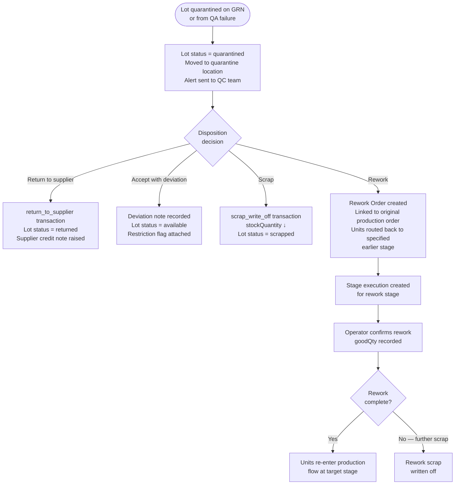
```mermaid
flowchart TD
    TRIG([Lot quarantined on GRN\nor from QA failure]) --> QUAR[Lot status = quarantined\nMoved to quarantine location\nAlert sent to QC team]

    QUAR --> DISP{Disposition\ndecision}

    DISP -- Return to supplier --> RTS[return_to_supplier transaction\nLot status = returned\nSupplier credit note raised]

    DISP -- Accept with deviation --> DEV[Deviation note recorded\nLot status = available\nRestriction flag attached]

    DISP -- Scrap --> SCRP[scrap_write_off transaction\nstockQuantity ↓\nLot status = scrapped]

    DISP -- Rework --> RW[Rework Order created\nLinked to original production order\nUnits routed back to specified\nearlier stage]

    RW --> RST[Stage execution created\nfor rework stage]
    RST --> RCONF[Operator confirms rework\ngoodQty recorded]
    RCONF --> RDONE{Rework\ncomplete?}
    RDONE -- Yes --> REJOIN[Units re-enter production\nflow at target stage]
    RDONE -- No — further scrap --> RWSC[Rework scrap\nwritten off]
```

---

## 5. Quality Assurance Flow

### 5.1 QA Inspection Lifecycle

Source: `lib/db/schema/quality.ts` — `qualityInspections`, `qualityCheckResults`.

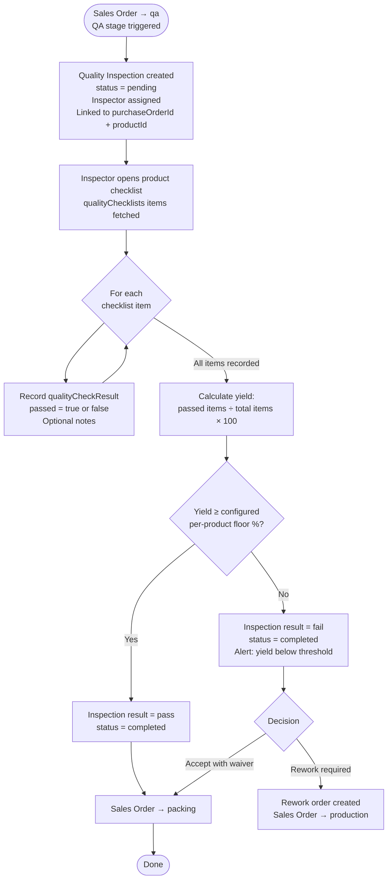
```mermaid
flowchart TD
    TRIG([Sales Order → qa\nQA stage triggered]) --> INS[Quality Inspection created\nstatus = pending\nInspector assigned\nLinked to purchaseOrderId + productId]

    INS --> CKLS[Inspector opens product checklist\nqualityChecklists items fetched]

    CKLS --> CKITEM{For each\nchecklist item}
    CKITEM --> CRES[Record qualityCheckResult\npassed = true or false\nOptional notes]
    CRES --> CKITEM

    CKITEM -- All items recorded --> YIELD[Calculate yield:\npassed items ÷ total items × 100]
    YIELD --> FLOOR{Yield ≥ configured\nper-product floor %?}

    FLOOR -- Yes --> PASS[Inspection result = pass\nstatus = completed]
    PASS --> PACK[Sales Order → packing]
    PACK --> DONE([Done])

    FLOOR -- No --> FAIL[Inspection result = fail\nstatus = completed\nAlert: yield below threshold]
    FAIL --> DEC{Decision}
    DEC -- Accept with waiver --> PACK
    DEC -- Rework required --> RW[Rework order created\nSales Order → production]
```

---

### 5.2 Quality Gates at Production Stages

In-process quality checks that can block a stage before confirmation continues.

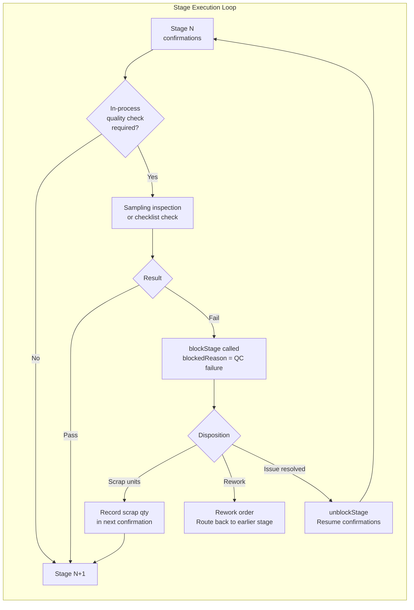
```mermaid
flowchart LR
    subgraph StageLoop["Stage Execution Loop"]
        S1[Stage N\nconfirmations] --> QCK{In-process\nquality check\nrequired?}
        QCK -- No --> S2[Stage N+1]
        QCK -- Yes --> INSP[Sampling inspection\nor checklist check]
        INSP --> RES{Result}
        RES -- Pass --> S2
        RES -- Fail --> BLK[blockStage called\nblockedReason = QC failure]
        BLK --> DISP2{Disposition}
        DISP2 -- Scrap units --> SCNF[Record scrap qty\nin next confirmation]
        SCNF --> S2
        DISP2 -- Rework --> RWST[Rework order\nRoute back to earlier stage]
        DISP2 -- Issue resolved --> UNB[unblockStage\nResume confirmations]
        UNB --> S1
    end
```

---

## 6. Planning and Scheduling

### 6.1 Production Schedule View and Job Card Reassignment

Source: Planning artifact FR35, FR36. `productionStageExecutions` carries `machineId`, `operatorId`, `shift`.

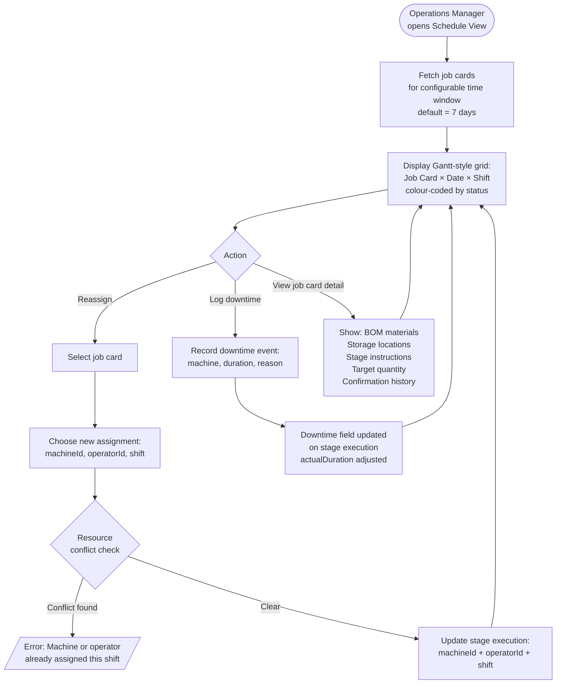
```mermaid
flowchart TD
    OPN([Operations Manager\nopens Schedule View]) --> FETCH[Fetch job cards\nfor configurable time window\ndefault = 7 days]
    FETCH --> VIEW[Display Gantt-style grid:\nJob Card × Date × Shift\ncolour-coded by status]

    VIEW --> ACT{Action}

    ACT -- Reassign --> SEL[Select job card]
    SEL --> REAS[Choose new assignment:\nmachineId, operatorId, shift]
    REAS --> CONF{Resource\nconflict check}
    CONF -- Conflict found --> CERR[/Error: Machine or operator\nalready assigned this shift/]
    CONF -- Clear --> SAVE[Update stage execution:\nmachineId + operatorId + shift]
    SAVE --> VIEW

    ACT -- Log downtime --> DT[Record downtime event:\nmachine, duration, reason]
    DT --> DTS[Downtime field updated\non stage execution\nactualDuration adjusted]
    DTS --> VIEW

    ACT -- View job card detail --> JCD[Show: BOM materials\nStorage locations\nStage instructions\nTarget quantity\nConfirmation history]
    JCD --> VIEW
```

---

### 6.2 Resource Conflict Validation

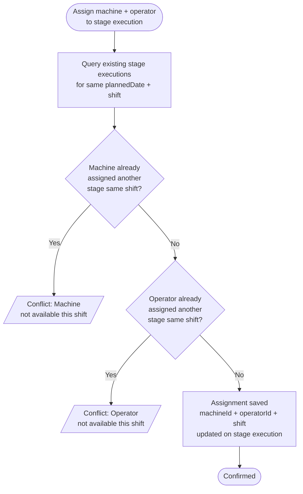
```mermaid
flowchart TD
    ASGN([Assign machine + operator\nto stage execution]) --> QM[Query existing stage executions\nfor same plannedDate + shift]

    QM --> CM{Machine already\nassigned another\nstage same shift?}
    CM -- Yes --> ME[/Conflict: Machine\nnot available this shift/]
    CM -- No --> CO{Operator already\nassigned another\nstage same shift?}
    CO -- Yes --> OE[/Conflict: Operator\nnot available this shift/]
    CO -- No --> OK[Assignment saved\nmachineId + operatorId + shift\nupdated on stage execution]
    OK --> CONF([Confirmed])
```

---

## 7. Roles Management and RBAC

### 7.1 Permission Check Flow

Source: `lib/auth/authorization.ts` — `hasPermission()` (line 13) and `requirePermission()` (line 43). Called at the top of every service method that mutates state.

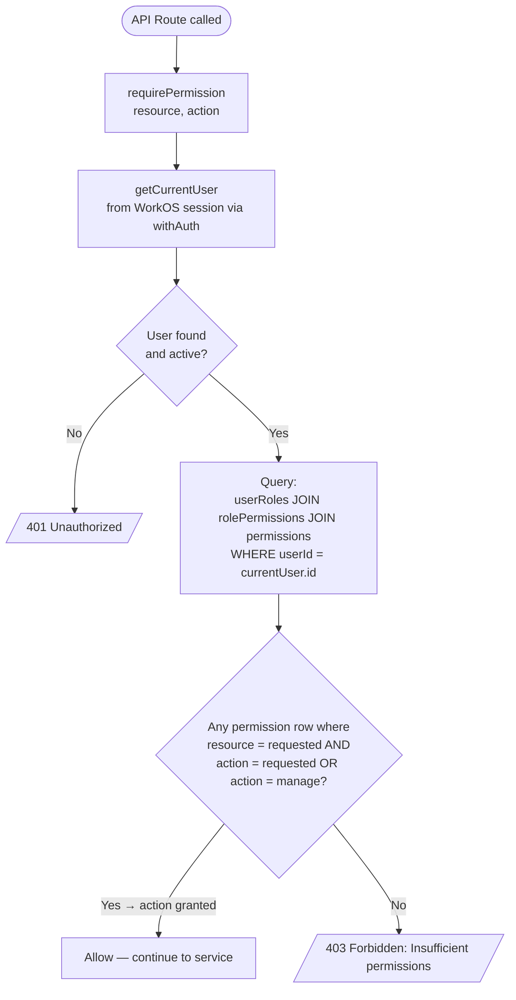
```mermaid
flowchart TD
    REQ([API Route called]) --> RP[requirePermission\nresource, action]
    RP --> CU[getCurrentUser\nfrom WorkOS session via withAuth]
    CU --> FOUND{User found\nand active?}
    FOUND -- No --> DENY1[/401 Unauthorized/]
    FOUND -- Yes --> QUERY[Query:\nuserRoles JOIN rolePermissions JOIN permissions\nWHERE userId = currentUser.id]

    QUERY --> CHECK{Any permission row where\nresource = requested AND\naction = requested OR action = manage?}

    CHECK -- Yes → action granted --> ALLOW[Allow — continue to service]
    CHECK -- No --> DENY2[/403 Forbidden: Insufficient permissions/]
```

---

### 7.2 Role Management Lifecycle

Source: `lib/db/schema/users.ts` — `roles`, `rolePermissions`, `userRoles`. System roles (`isSystem = true`) cannot be deleted.

```mermaid
flowchart TD
    ROOT([Role Management]) --> ACT{Action}

    ACT -- Create custom role --> CR1[Input: name, slug, description]
    CR1 --> CR2[INSERT roles\nisSystem = false\norganizationId scoped]
    CR2 --> CR3[Assign permissions via\nrolePermissions rows]

    ACT -- Preset system role --> PR1{Owner or Member?}
    PR1 -- Owner --> OWN[ensureSystemRoleForOrg\nfullAccess = true\nAll permissions inserted]
    PR1 -- Member --> MEM[ensureSystemRoleForOrg\nfullAccess = false\nNo permissions by default]

    ACT -- Edit permissions --> EP1{isSystem?}
    EP1 -- Yes system role --> EPE[Allowed — edit rolePermissions\neven for system roles]
    EP1 -- No custom role --> EP2[Add or remove rolePermissions rows]
    EPE --> CACHE[User cache expires on next request\n5-minute LRU TTL]
    EP2 --> CACHE

    ACT -- Delete role --> DR1{isSystem?}
    DR1 -- Yes --> DRE[/Error: Cannot delete\nsystem role/]
    DR1 -- No --> DR2{Users still\nassigned?}
    DR2 -- Yes --> DRE2[/Error: Reassign users\nbefore deleting/]
    DR2 -- No --> DR3[DELETE roles\nCASCADE removes rolePermissions]

    ACT -- Assign role to user --> AR1[INSERT userRoles\nuserId + roleId + optional plantId]
    AR1 --> CACHE
```

---

## 8. User Invitation Flow

### 8.1 Onboarding: WorkOS Invite to First Login

Source: `lib/auth/session.ts:getCurrentUser()`. Runs on every authenticated request. Result cached in LRU map (5-minute TTL).

```mermaid
flowchart TD
    CLICK([User follows invite link\nor authenticates via WorkOS]) --> AUTH[WorkOS AuthKit\nwithAuth — validate token\nreturns workosUser object]

    AUTH --> RESOLVE[resolveWorkOsOrganizationIdForUser\nGET /user_management/organization_memberships]

    RESOLVE --> ORGFND{Organization\nmembership found?}
    ORGFND -- No --> LOCEXIST{User exists\nin local DB?}
    LOCEXIST -- Yes --> SUSP[Return null\nUser treated as suspended\n401 on all routes]
    LOCEXIST -- No --> ORGSEL[Return needsOrganizationSelection\nRedirect to org selection page]

    ORGFND -- Yes --> DBUSER[Look up local user\nby workosUserId]
    DBUSER --> EXISTS{Local user\nrecord exists?}

    EXISTS -- No — first login --> ENSORG[Ensure local Organization exists\nCreate from WorkOS org ID if needed]
    ENSORG --> FIRST{First user\nin this org?}
    FIRST -- Yes --> OWN[Assign Owner role\nfullAccess = true\nAll permissions granted]
    FIRST -- No --> MEMB[Assign Member role\nfullAccess = false\nNo permissions by default]
    OWN --> NEWU[INSERT users record]
    MEMB --> NEWU
    NEWU --> SESSION([Session established])

    EXISTS -- Yes — returning user --> ORGCHK{WorkOS org\nchanged for user?}
    ORGCHK -- Yes --> MOVE[Move user to new org\nDelete old userRoles\nRe-assign Owner or Member\nbased on position in new org]
    MOVE --> SUSCHK
    ORGCHK -- No --> SUSCHK{user.status\n= suspended?}
    SUSCHK -- Yes --> DENY[Return null → 401]
    SUSCHK -- No --> UPDT[UPDATE lastLoginAt\nCache result 5-min LRU]
    UPDT --> SESSION
```

---

### 8.2 Role Assignment Update and Access Revocation

```mermaid
flowchart TD
    ADMIN([Admin updates user role]) --> DEL[DELETE existing userRoles\nfor this userId]
    DEL --> INS[INSERT new userRoles\nuserId + roleId + optional plantId]
    INS --> CACHE[In-memory cache not\nimmediately invalidated]
    CACHE --> TTL{5-minute cache\nTTL elapsed?}
    TTL -- No --> OLDP[Previous permissions\nstill active until expiry]
    TTL -- Yes --> NEWP[Next request re-queries DB\nNew permissions take effect]

    SUSADM([Admin suspends user]) --> SETSUSP[SET user.status = suspended]
    SETSUSP --> NEXTREQ[Next request: getCurrentUser\nreturns null]
    NEXTREQ --> BLKALL[All requests → 401 Unauthorized]

    REVOKE([Admin removes a specific permission]) --> DELPERM[DELETE rolePermissions row\nfor permission on that role]
    DELPERM --> ALLUSERS[All users with that role\nlose permission after cache expiry]
    ALLUSERS --> TTL
```

---

## 9. Tenant Isolation

Single request flow showing how `organizationId` gates all data access. Source: `middleware.ts`, `lib/auth/session.ts`, `lib/services/base.service.ts`.

```mermaid
flowchart TD
    HTTP([HTTP Request]) --> MW[middleware.ts\nGlobal auth interceptor]
    MW --> PUB{Path excluded?\n/auth/* or\n/organizations/select}
    PUB -- Yes --> PUBH[Public handler\nNo auth required]
    PUB -- No --> WA[withAuth from WorkOS\nValidate session token]

    WA --> VALID{Valid\nsession token?}
    VALID -- No --> REDIR[Redirect to /auth/login]
    VALID -- Yes --> GCU[getCurrentUser\nWorkOS userId → local user record]

    GCU --> UACT{User found\nand active?}
    UACT -- No --> U401[401 Unauthorized]
    UACT -- Yes --> ORGID[organizationId extracted\nfrom user.organizationId\nLinked to WorkOS org via\norganization.workosOrganizationId]

    ORGID --> ROUTE[API Route handler]
    ROUTE --> BSV[BaseService.getOrganizationId\nreturns verified organizationId]
    BSV --> REPO[Repository method called\nAll queries include:\nWHERE organizationId = orgId]

    REPO --> ISOLATION{Data row\nbelongs to\nthis org?}
    ISOLATION -- Yes --> DATA[Return data]
    ISOLATION -- No → row excluded by WHERE clause --> NOTFND[404 Not Found\nor empty array]
```

---

## 10. Notification Flow

Source: Planning artifacts FR48, FR49. Delivery is in-app via Notification Centre polled by React Query (60-second interval).

```mermaid
flowchart TD
    subgraph Triggers["Alert Triggers"]
        T1[Stock level ≤ reorder level\nper inventory item]
        T2[Sales Order past due date\nstatus not done or cancelled]
        T3[Stage blocked:\nblockedAt set on stage execution]
        T4[Quality yield below\nconfigured per-product floor %]
        T5[Machine breakdown:\ndowntime event logged]
        T6[Material shortage\nreported from job card]
    end

    T1 --> CREATE[Create alert record:\ntype + severity\nentityRef + timestamp]
    T2 --> CREATE
    T3 --> CREATE
    T4 --> CREATE
    T5 --> CREATE
    T6 --> CREATE

    CREATE --> ROUTE{Alert type\nrole routing}

    ROUTE -- Stock reorder / shortage --> IC[Inventory Controller\nProcurement Manager]
    ROUTE -- Overdue order --> OM[Operations Manager\nSales Manager]
    ROUTE -- Stage blocked / breakdown --> PS[Operations Manager\nProduction Supervisor]
    ROUTE -- Quality yield failure --> QC[QC Inspector\nOperations Manager]

    IC --> NC[In-app Notification Centre\nUnread badge count updated]
    OM --> NC
    PS --> NC
    QC --> NC

    NC --> POLL[React Query polling\n60-second interval]
    POLL --> USER[User sees unread alerts\nwith timestamps and deep\nlinks to related records]
    USER --> READ[User marks as read\nalert.status = read]
```

---

## Appendix: Status Colour Mapping

Consistent colour coding for status badges, timeline highlights, and dashboard indicators across all UI views.

### Sales Order Status

| Status | Colour | Hex (approx) | Meaning |
|---|---|---|---|
| `pending` | Grey | `#6B7280` | Received, awaiting material allocation |
| `allocated` | Blue | `#3B82F6` | Materials reserved, production order created |
| `production` | Amber | `#F59E0B` | Active manufacturing in progress |
| `qa` | Purple | `#8B5CF6` | Quality inspection underway |
| `packing` | Indigo | `#6366F1` | Packing and despatch preparation |
| `done` | Green | `#10B981` | Order fulfilled and shipped |
| `cancelled` | Red | `#EF4444` | Cancelled at any stage |

### Production Order Status

| Status | Colour | Hex (approx) | Meaning |
|---|---|---|---|
| `created` | Grey | `#9CA3AF` | Just created, no job card yet |
| `pending` | Light Blue | `#93C5FD` | Job card exists, no work started |
| `in_progress` | Amber | `#F59E0B` | At least one stage is ongoing |
| `blocked` | Red | `#DC2626` | At least one stage blocked — escalation required |
| `completed` | Green | `#10B981` | All stages — confirmedGood ≥ plannedQty |
| `cancelled` | Red | `#EF4444` | Manually cancelled |

### Stage Execution Status

| Status | Colour | Hex (approx) | Meaning |
|---|---|---|---|
| `not_started` | Grey | `#9CA3AF` | No confirmations recorded yet |
| `ongoing` | Blue | `#3B82F6` | Confirmations in progress, target not yet reached |
| `completed` | Green | `#10B981` | confirmedGood ≥ plannedQuantity |
| `blocked` | Red | `#DC2626` | blockedAt set, unblockedAt null — work halted |

### Job Card Status

| Status | Colour | Hex (approx) | Meaning |
|---|---|---|---|
| `planned` | Grey | `#9CA3AF` | All stages not yet started |
| `in_progress` | Amber | `#F59E0B` | Work in progress |
| `on_hold` | Orange | `#F97316` | Manually paused |
| `completed` | Green | `#10B981` | All stages auto-completed |
| `terminated` | Blue-Grey | `#64748B` | Final stage met target — manually closed |
| `cancelled` | Red | `#EF4444` | Cancelled before completion |

### Quality Inspection

| Status / Result | Colour | Hex (approx) | Meaning |
|---|---|---|---|
| `pending` | Grey | `#9CA3AF` | Awaiting inspector action |
| `completed / pass` | Green | `#10B981` | All checks passed, yield above floor |
| `completed / fail` | Red | `#DC2626` | One or more checks failed or yield below floor |

### Inventory Stock Status

| Status | Colour | Hex (approx) | Trigger |
|---|---|---|---|
| `OK` | Green | `#10B981` | availableStock > reorderLevel |
| `Low` | Amber | `#F59E0B` | availableStock ≤ reorderLevel |
| `Critical` | Red | `#DC2626` | availableStock ≤ reorderLevel ÷ 2 |

### Inventory Capacity Status

| Status | Colour | Hex (approx) | Trigger |
|---|---|---|---|
| `OK` | Green | `#10B981` | stockQty < 80% of maxCapacity |
| `Near Capacity` | Amber | `#F59E0B` | stockQty 80%–94% of maxCapacity |
| `At Capacity` | Red | `#DC2626` | stockQty ≥ 95% of maxCapacity |
