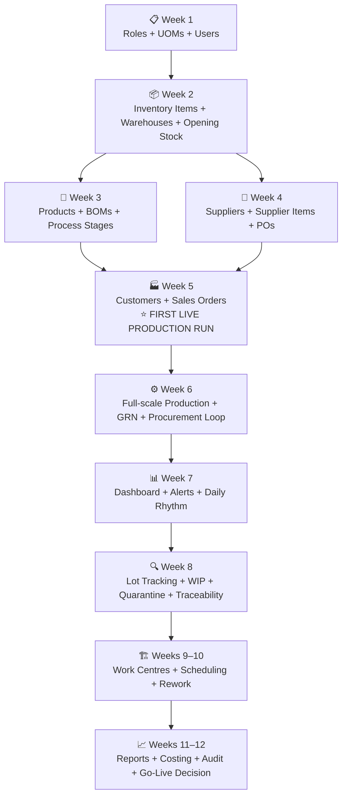

# Pilot Implementation Plan: SYPM — EV Cable Assembly Factory

## Context

Nexus Factory has been fully built per the PRD (all 20 gap items resolved across Phases A-E). We are deploying it as a pilot at **SYPM**, a small factory that manufactures **EV charging cables and connectors**. This plan sequences the week-by-week data entry and feature rollout, respecting data dependencies (e.g., inventory items must exist before BOMs can reference them, BOMs before production orders, suppliers before POs, etc.).

SYPM has **13 finished products**, **~19 unique raw materials**, **3 UOM categories** (length, weight, count), and manufacturing processes ranging from 7 to 14 operations per product.

---

## Factory Data Summary

### Products (13)
| # | Product | # Operations | # BOM Materials |
|---|---------|-------------|-----------------|
| 1 | 750W Input Cable | 14 | 12 |
| 2 | 750W Output Cable | 9 | 7 |
| 3 | 400W Input Cable | 10 | 8 |
| 4 | 400W Output Cable | 9 | 4 |
| 5 | 500W Input Cable | 7 | 5 |
| 6 | 500W Output Cable | 7 | (BOM not in sheet — needs SYPM input) |
| 7 | BAL IP Cable - 3P | 9 | (see BAL 3P Plug BOM) |
| 8 | BAL IP 750 | 8 | 7 |
| 9 | BAJAJ 750W Output Connector | 8 | 7 |
| 10 | BAL 3P Plug | (see BAL IP Cable - 3P process) | 6 |
| 11 | SERVICE CABLE (PC, DOT, DUO, LCPC) | (not in process sheet) | 7 |
| 12 | Plug and Cable Assembly | (not in process sheet) | 4 |
| 13 | Onboard Cable | (not in process sheet) | 4 |

### Unique Raw Materials (~19)
| Material | UOM | Category |
|----------|-----|----------|
| 3C *0.75 sqmm Cable | mtrs | Cable |
| 4C AWG Cable | mtrs | Cable |
| 4C Sqmm Cable | mtrs | Cable |
| 4C 2.5 sqmm Cable | mtrs | Cable |
| 5C Cable | mtrs | Cable |
| 3P Inserts | nos | Connector Component |
| 3P Caps | nos | Connector Component |
| PVC FR 90 | grams | Moulding Compound |
| PVC FR 90 SANKHLA | grams | Moulding Compound |
| PVC AP102 | grams | Moulding Compound |
| Enclosure (Customer-supplied) | nos | Customer-Supplied |
| Grommet (Customer-supplied) | nos | Customer-Supplied |
| O-Ring | nos | Sealing |
| Shrink Wrap | mtrs | Packaging/Assembly |
| Foam Sheet | nos | Packaging |
| Rubber Band | nos | Packaging |
| Carton Box | nos | Packaging |
| Customer Cable (MINDA) | nos | Customer-Supplied |
| Customer Cable (Amphenol) | nos | Customer-Supplied |

### UOMs Required
| UOM | Abbreviation | Category |
|-----|-------------|----------|
| Metres | mtrs | Length |
| Grams | g | Weight |
| Kilograms | kg | Weight |
| Numbers/Pieces | nos | Count |

### Key Manufacturing Operations (across products)
- Cutting and Stripping
- Inner Core Stripping / Semi Stripping / Secondary Stripping
- Insert Crimping
- Insert Moulding (15T / 45T / 60T press)
- Grommet Moulding (15T / 45T / 60T press)
- Grommet Insertion
- Enclosure Wrapping / Insertion
- O-Ring Insertion
- Gauge Checking
- Multi Plug Testing
- Inspection and Length Checking
- Differential Cutting
- Winding and Packing

---

## Week-by-Week Implementation Plan

### Pre-Pilot (Before Week 1)
**Goal: Environment setup and admin access**

| # | Task | Who | System Feature |
|---|------|-----|----------------|
| 1 | Deploy Nexus Factory to production (Vercel + Supabase) | IT / Dev Team | Infrastructure |
| 2 | Create SYPM's organisation in WorkOS | IT Admin | Org Management |
| 3 | Create the System Admin account, log in, verify access | SYPM IT lead | Auth (WorkOS) |
| 4 | Gather any missing data: BOM for 500W Output Cable, process steps for Service Cable / Plug Assembly / Onboard Cable | SYPM Factory Manager | Offline |

**Dependencies:** None — this is the starting point.

---

### Week 1: Foundation Setup (Settings & Admin)
**Goal: Roles, users, UOMs — the platform skeleton**
**System modules: Settings & Admin, UOM Management, RBAC**
**Epics: Epic 1 (Stories 1.1, 1.2, 1.3, 1.4, 1.5)**

| Day | Task | Detail | Depends On |
|-----|------|--------|------------|
| Mon | **Configure Roles** | Create roles from presets: Factory Owner, Operations Manager, Production Operator (x3-5 workers), Inventory Controller, QA Inspector, Procurement Manager. Customise permissions per role. | Org exists |
| Mon | **Set up UOMs** | Create UOM catalogue: mtrs, g, kg, nos. Add UOM conversions: g <-> kg (factor 0.001). | Org exists |
| Tue | **Invite Users** | Invite all SYPM staff by email with appropriate roles. Target: ~10-15 users for the pilot (Owner, 1 Manager, 1 Inventory Controller, 1 QA Inspector, 1 Procurement, 5-8 Operators). | Roles configured |
| Tue | **Configure Org Settings** | Set Production Order Creation mode (recommend: Manual for pilot). | Org exists |
| Wed-Thu | **User Onboarding** | Each invited user logs in, verifies access, sees role-appropriate sidebar. Quick walkthrough (should need zero training per UX philosophy). | Invitations sent |
| Fri | **Validate** | Verify: all users can log in, see correct menu items, cannot access restricted areas. Test org isolation. | All users onboarded |

**Deliverable:** All SYPM users active, roles configured, UOMs ready.
**Risk:** User email access issues — have backup invitation method ready.

---

### Week 2: Inventory Master Data
**Goal: All raw materials and finished goods catalogued in the system**
**System modules: Inventory Item Management, Warehouse & Locations**
**Epics: Epic 5 (Stories 5.1, 5.2)**

| Day | Task | Detail | Depends On |
|-----|------|--------|------------|
| Mon | **Create Warehouses** | Set up warehouse structure: (1) Raw Material Store, (2) Finished Goods Store, (3) WIP Area, (4) Quarantine. | UOMs exist |
| Mon | **Define Storage Locations** | Create location hierarchy per warehouse. E.g., Raw Material Store -> Zone A (Cables) -> Rack 1 -> Bin 1-5; Zone B (Moulding Compounds); Zone C (Components & Packaging). | Warehouses exist |
| Tue | **Create Raw Material Inventory Items (Cables)** | Enter 5 cable types: 3C*0.75 sqmm, 4C AWG, 4C Sqmm, 4C 2.5 sqmm, 5C Cable. UOM: mtrs. Set reorder levels based on SYPM's current stock norms. | UOMs exist |
| Tue | **Create Raw Material Inventory Items (Moulding Compounds)** | Enter 3 PVC types: PVC FR 90, PVC FR 90 SANKHLA, PVC AP102. UOM: grams. Set reorder levels. | UOMs exist |
| Wed | **Create Raw Material Inventory Items (Components)** | Enter: 3P Inserts, 3P Caps, O-Ring, Shrink Wrap (UOM: mtrs), Enclosure, Grommet. Set reorder levels. | UOMs exist |
| Wed | **Create Raw Material Inventory Items (Packaging)** | Enter: Foam Sheet, Rubber Band, Carton Box. UOM: nos. | UOMs exist |
| Wed | **Create Customer-Supplied Items** | Enter: Customer Cable (MINDA), Customer Cable (Amphenol). Mark these distinctly — they are supplied by SYPM's customer, not procured. | UOMs exist |
| Thu | **Create Finished Goods Inventory Items** | Enter all 13 products as finished goods items: 750W Input/Output, 400W Input/Output, 500W Input/Output, BAL IP Cable, BAL IP 750, BAJAJ 750W Output, BAL 3P Plug, Service Cable, Plug & Cable Assembly, Onboard Cable. UOM: nos. | UOMs exist |
| Thu | **Record Opening Stock** | Physical stock count of all raw materials at SYPM. Enter opening balances via Manual Adjustment (reason: count correction). This is the baseline. | All items created |
| Fri | **Validate** | Verify: all 19+ raw materials listed, all 13 finished goods listed, opening stock matches physical count, reorder levels trigger alerts correctly for any item already below threshold. | Opening stock entered |

**Deliverable:** Complete inventory master data with opening balances.
**Risk:** Inconsistent material naming from SYPM's Excel (e.g., "o-ring" vs "O-Ring") — standardise names during entry.

**Data entry volume:** ~32 inventory items + opening stock transactions + warehouse/location setup.

> **Note:** The `npm run db:seed:sypm` script pre-loads all inventory items, products, BOMs, process stages, suppliers, and customers automatically. Week 2 tasks are reduced to: creating warehouses/locations, recording opening stock quantities, and verifying the seeded data matches SYPM's physical records.

---

### Week 3: Products, BOMs & Process Stages
**Goal: All products fully defined with BOMs and manufacturing process stages**
**System modules: Product Management, BOM, Process Stage Definitions, Quality Checklists**
**Epics: Epic 2 (Stories 2.1, 2.2)**

| Day | Task | Detail | Depends On |
|-----|------|--------|------------|
| Mon | **Verify Seeded Products (Batch 1)** | Review first 5 products in UI: 750W Input Cable, 750W Output Cable, 400W Input Cable, 400W Output Cable, 500W Input Cable. Confirm BOM quantities and UOMs match SYPM's Excel. | Seed script run |
| Mon | **Verify BOMs (Batch 1)** | Cross-check each BOM line item against SYPM's source data. Correct any discrepancies directly in the UI. | Products seeded |
| Tue | **Verify Products (Batch 2)** | Review remaining 8 products. Flag any data gaps (500W Output Cable BOM is a placeholder). | Seed script run |
| Tue | **Fill Missing BOM Data** | Obtain 500W Output Cable BOM from SYPM factory manager. Update in system. | SYPM manager input |
| Wed | **Verify Process Stages (Batch 1)** | Confirm stage sequences and cycle times for 750W Input (14 stages), 750W Output (9), 400W Input (10), 400W Output (9). | Products seeded |
| Thu | **Verify Process Stages (Batch 2)** | Confirm stages for 500W Input (7), 500W Output (7), BAL IP Cable (9), BAL IP 750 (8), BAJAJ 750W Output (8). Add missing stages for Service Cable / Plug Assembly / Onboard Cable. | SYPM manager input |
| Thu | **Review Quality Checklists** | Standard 6-item checklist is pre-seeded for all products. Add any product-specific checks with SYPM QA team. | Process stages verified |
| Fri | **Validate** | Verify: every product has a complete BOM, stages in correct sequence, quality checklists attached. | All data verified |

**Deliverable:** All products production-ready in the system.
**Risk:** BOM data gaps for some products — work with SYPM factory manager to fill gaps before Week 4.

---

### Week 4: Suppliers & Procurement Setup
**Goal: Supplier records and item catalogues ready for purchase orders**
**System modules: Supplier Management, Supplier Item Catalogue**
**Epics: Epic 4 (Stories 4.1, 4.2)**

| Day | Task | Detail | Depends On |
|-----|------|--------|------------|
| Mon | **Verify Seeded Suppliers** | Review the 5 pre-seeded suppliers: Apex Cables, Sankhla Polymers, Supreme Polymers, Ritesh Components, National Packaging. Confirm contact details and payment terms with SYPM procurement team. | Seed script run |
| Mon-Tue | **Update Supplier Details** | Correct any contact info, payment terms, lead times. Add any additional suppliers not covered by the seed data. | Procurement team input |
| Wed | **Update Supplier Item Prices** | Seed data uses placeholder prices. Update with actual contracted unit prices and MOQs for each supplier-item combination. | Actual price list from suppliers |
| Thu | **Create Initial Purchase Orders** | Enter any currently open/pending POs that SYPM has with suppliers. If there are in-transit deliveries, create POs and record partial GRNs. | Supplier items updated |
| Fri | **Validate** | Verify: all suppliers listed, item catalogues correct, PO creation works with pre-populated pricing, MOQ warnings fire correctly. | POs created |

**Deliverable:** Procurement fully operational — can create POs against real suppliers.
**Risk:** Supplier pricing may be commercially sensitive — ensure only Procurement Manager role can see prices.

---

### Week 5: Customer & Sales Order Setup + First Live Production Run
**Goal: Enter customers, create first real sales orders, run a pilot production order**
**System modules: Customer Management, Sales Orders, Production Orders, Job Cards**
**Epics: Epic 3 (Stories 3.1, 3.3, 3.6), Epic 2 (Stories 2.3, 2.4)**

| Day | Task | Detail | Depends On |
|-----|------|--------|------------|
| Mon | **Verify Seeded Customers** | Review pre-seeded customers: Bajaj Auto Ltd, MINDA Industries, Amphenol India, Generic EV Customer. Update contact details, billing/shipping addresses. | Seed script run |
| Mon | **Create First Sales Order** | Pick SYPM's simplest product (e.g., BAL 3P Plug — fewest operations). Create a real sales order for an upcoming customer order. | Customers verified, Products exist |
| Tue | **Allocate Sales Order -> Create Production Order** | Allocate the sales order (status: pending -> allocated). Manually create a production order from the allocated line item. Verify job cards are auto-generated for each process stage. | Sales order created, BOM complete |
| Tue-Wed | **First Live Production Run (Supervised)** | **This is the critical pilot moment.** Have SYPM operators use Nexus Factory to execute the production order: (1) Operators see job card queue on tablet, (2) Start first stage, (3) Confirm stage with good/scrap/rework quantities, (4) Verify material backflush decremented inventory correctly, (5) Progress through all stages. IT/Manager supervises alongside. | Production order with job cards |
| Thu | **QA Inspection** | QA Inspector performs quality inspection using the pre-configured checklist. Record pass/fail per unit. Verify quality yield calculation. | Production stages completed |
| Thu | **Complete Production Order** | Verify finished goods auto-receipt incremented FG inventory. Verify production order status progression: production -> qa -> packing -> done. | QA passed |
| Fri | **Retrospective & Fixes** | Review: What worked? What was confusing? Any data errors? Correct any issues before scaling to more products next week. | First run complete |

**Deliverable:** First end-to-end production cycle completed in Nexus Factory.
**Key success metric:** SYPM operators completed stage confirmations without training (zero-training-curve validation).

---

### Week 6: Scale to All Products + Goods Receipt
**Goal: Run production for all product lines, process first GRN**
**System modules: Production (all products), GRN, Partial Fulfilment**
**Epics: Epic 2 (all stories), Epic 4 (Stories 4.3, 4.4, 4.5)**

| Day | Task | Detail | Depends On |
|-----|------|--------|------------|
| Mon | **Create Sales Orders for All Active Customer Orders** | Enter all current real customer orders across all product lines. | Customers exist |
| Mon-Tue | **Run Production Orders (Full Scale)** | Create and execute production orders for multiple products simultaneously. Multiple operators working their job card queues in parallel. Monitor backflush accuracy across different BOM complexities. | Sales orders allocated |
| Wed | **Process First Goods Receipt** | When a supplier delivery arrives, use GRN workflow: create GRN against PO, record received quantities, assign to storage locations, handle any quarantined items. Verify inventory auto-increments. | PO exists, delivery arrives |
| Wed | **Test Partial Fulfilment** | If a delivery is short, record partial receipt. Verify outstanding balance visible on PO. | GRN processed |
| Thu | **Material Shortage Test** | During production, if an operator encounters a shortage, use the "Report Shortage" workflow. Verify notifications reach Operations Manager and Inventory Controller. | Production in progress |
| Fri | **Validate Inventory Accuracy** | Physical stock count of key items. Compare against Nexus Factory's inventory levels. Identify and correct any discrepancies via manual adjustments. | Week of transactions |

**Deliverable:** All product lines running through Nexus Factory. Procurement loop (PO -> GRN -> Stock) validated.
**Key metric:** Inventory count accuracy — system matches physical count.

---

### Week 7: Dashboard, Alerts & Daily Operations Rhythm
**Goal: Management starts using Nexus Factory as their single source of truth**
**System modules: Dashboard KPIs, Notifications, Reorder Alerts**
**Epics: Epic 7 (Stories 7.1, 7.2, 7.3, 7.4, 7.5)**

| Day | Task | Detail | Depends On |
|-----|------|--------|------------|
| Mon | **Dashboard Orientation** | SYPM Factory Owner and Operations Manager start using the dashboard as their morning check-in: review 5 KPIs (active orders, throughput, yield, low stock, overdue). Drill down to any flagged items. | Production data exists |
| Mon | **Configure Notification Preferences** | Each user configures their alert preferences (in-app always on; email opt-in for critical alerts). Operations Manager: all alerts. Operators: job card assignments only. | Users active |
| Tue | **Reorder Alert Validation** | Verify that items below reorder level trigger alerts. Procurement Manager sees low-stock items and creates POs directly from the alert drill-down. | Reorder levels set, stock consumed |
| Wed | **Establish Daily Rhythm** | Morning: Manager checks dashboard -> identifies blockers. Operators: open queue -> work through cards. Inventory: monitor stock levels -> raise POs. QA: inspect completed batches. End of day: Manager reviews throughput. | All modules active |
| Thu-Fri | **Parallel Operations** | Full day of normal factory operations running through Nexus Factory. No parallel spreadsheet. Manager does NOT call anyone for status — uses dashboard only. | All modules active |

**Deliverable:** Management operating from the dashboard. Zero phone calls for status updates.
**Key metric:** Manager can find any order's status in <30 seconds.

---

### Week 8: Advanced Features & Stabilisation
**Goal: Activate remaining features, stabilise, measure adoption**
**System modules: Lot Traceability, WIP View, Quarantine, Stock Transfers**
**Epics: Epic 5 (Stories 5.3-5.9)**

| Day | Task | Detail | Depends On |
|-----|------|--------|------------|
| Mon | **Lot Tracking Activation** | Start assigning lot numbers at GRN. Track lots through production consumption. | GRN workflow active |
| Tue | **WIP Inventory View** | Inventory Controller reviews WIP view: Allocated vs Consumed vs ATP for key materials. Verify accuracy against physical WIP. | Production running |
| Wed | **Quarantine Workflow** | If any received material has quality issues, move to quarantine location. Practice disposition workflow (return to supplier / scrap / accept with deviation). | Lot tracking active |
| Thu | **Stock Transfers** | Practice inter-location transfers (e.g., move cable reels from receiving to production floor staging area). Verify lot records update. | Locations exist |
| Fri | **Lot Traceability Test** | Pick a raw material lot -> trace forward to which production orders consumed it. Pick a finished goods batch -> trace backward to raw material lots. Verify complete chain. | Production with lots |

**Deliverable:** Full material traceability operational.

---

### Week 9-10: Work Centres, Scheduling & Refinement
**Goal: Production scheduling and work centre management live**
**System modules: Work Centres, Machines, Production Schedule, Rework**
**Epics: Epic 6 (Stories 6.1-6.6)**

| Week | Task | Detail |
|------|------|--------|
| Week 9 Mon-Tue | **Create Work Centres** | Define work centres for SYPM: (1) Cutting Station, (2) Stripping Station, (3) Crimping Station, (4) Moulding Area — 15T Press, 45T Press, 60T Press, (5) Assembly Station, (6) Testing/Inspection Station, (7) Packing Station. Set capacity per shift and cost rates. |
| Week 9 Wed | **Create Machines** | Register individual machines: each moulding press (15T, 45T, 60T), cutting machines, crimping tools. Add capability tags, maintenance schedules. |
| Week 9 Thu-Fri | **Assign Job Cards to Work Centres** | Link process stages to work centres. View production schedule — 7-day view of job cards across work centres. Identify capacity conflicts. |
| Week 10 Mon-Tue | **Job Card Reassignment** | Practice reassigning a job card from one operator/work centre to another. Verify notifications. |
| Week 10 Wed | **Rework Workflow** | When QA rejects units, initiate rework order. Verify rework job card appears in operator queue tagged as "Rework". Track reworked units separately. |
| Week 10 Thu-Fri | **Machine Downtime Logging** | Log a planned maintenance event on a moulding press. Log an unplanned breakdown. Verify alerts to Operations Manager. |

**Deliverable:** Full production scheduling and shop floor management.

---

### Week 11-12: Reporting, Audit Trail & Go-Live Readiness
**Goal: Business intelligence active, pilot evaluation complete**
**System modules: Reports, Audit Trail, Production Costing**
**Epics: Epic 8 (Stories 8.1-8.4), Epic 9 (Stories 9.1-9.6)**

| Week | Task | Detail |
|------|------|--------|
| Week 11 Mon | **Product Categories** | Organise SYPM products into categories: Input Cables, Output Cables, Connectors/Plugs, Service Cables. |
| Week 11 Tue-Wed | **Generate Reports** | Generate: Inventory Valuation report, Stock Movement report (last 30 days), Production Output report, Quality Summary. Download as Excel/PDF. |
| Week 11 Thu | **Production Costing** | Calculate standard cost for each product (BOM material costs + work centre rates). Compare against actual costs accumulated during pilot production runs. |
| Week 11 Fri | **Audit Trail Review** | Review audit log: verify all data changes are tracked. Demonstrate traceability for any entity. |
| Week 12 Mon-Tue | **Scheduled Reports** | Set up weekly report schedule: Production Output + Quality Summary emailed to SYPM Factory Owner every Monday morning. |
| Week 12 Wed | **Final Inventory Reconciliation** | Full physical stock count at SYPM. Compare against Nexus Factory. Target: zero discrepancy on all items that have been transacted through the system. |
| Week 12 Thu | **Pilot Evaluation** | Measure against success criteria: (1) Daily active rate among pilot users, (2) Time for manager to find any order status (<30s target), (3) Inventory accuracy, (4) Any parallel spreadsheet usage? (target: zero), (5) Operator feedback on ease of use. |
| Week 12 Fri | **Go/No-Go Decision** | Based on evaluation: proceed to full production use, extend pilot, or address gaps. |

---

## Dependency Graph (Critical Path)



**Note:** Weeks 3 and 4 can run in parallel (BOMs don't depend on suppliers; suppliers don't depend on BOMs). The critical dependency convergence is Week 5, where Sales Orders need both Products (Week 3) and Customers (Week 5 Mon), and Production needs BOMs (Week 3).

---

## Resource Requirements

| Role | Time Commitment | Weeks Active |
|------|----------------|-------------|
| SYPM IT Lead / System Admin | Full-time Weeks 1-2, part-time after | 1-12 |
| Operations Manager | 2-3 hrs/day Weeks 1-5, then daily use | 1-12 |
| Inventory Controller | Full-time Week 2 (data entry), then daily use | 2-12 |
| Procurement Manager | Full-time Week 4, then daily use | 4-12 |
| Production Operators (5-8) | Onboarded Week 1, first use Week 5, daily after | 5-12 |
| QA Inspector | First use Week 5, daily after | 5-12 |
| SYPM Factory Owner | Dashboard orientation Week 7, periodic after | 7-12 |
| Dev/Support Team | On-call for issues throughout | 1-12 |

---

## Risk Mitigation

| Risk | Likelihood | Mitigation |
|------|-----------|------------|
| Operators resist tablet-based workflow | Medium | Zero-training-curve UX is the mitigation; Week 5 supervised run validates this |
| BOM data incomplete for some products | High | Flag gaps in Week 2-3; SYPM factory manager must provide missing data before Week 5 |
| Inventory count drift after go-live | Medium | Weekly physical spot-checks in Weeks 6-8; investigate any drift immediately |
| Internet connectivity on factory floor | Medium | Ensure reliable WiFi/LAN at operator stations; no offline mode in v1 |
| Supplier pricing data unavailable | Low | Enter Rs.0 placeholder; update as actual POs are raised |
| Customer-supplied materials tracking | Low | Track as regular inventory items with Rs.0 cost; receipt via manual adjustment when customer delivers |

---

## Seed Script Reference

All master data (inventory items, products, BOMs, process stages, quality checklists, suppliers, customers) is pre-loaded by the seed script. Run before starting Week 2:

```bash
npm run db:push          # 1. Push schema to database
npm run db:seed          # 2. Seed system permissions + standard UOMs
npm run db:seed:sypm     # 3. Seed SYPM factory data
```

**Before running in production**, update these two constants in `lib/db/seed-sypm.ts`:
```typescript
const SYPM_WORKOS_ORG_ID = 'org_sypm_pilot_seed';   // → real WorkOS org ID
const SYPM_WORKOS_USER_ID = 'user_sypm_seed_admin';  // → real admin WorkOS user ID
```

**Known data gaps to resolve with SYPM factory manager:**
- BOM for 500W Output Cable (placeholder data entered)
- Process stages for Service Cable, Plug and Cable Assembly, Onboard Cable (estimated stages entered)
- Actual supplier unit prices (placeholder prices entered)
- Opening stock quantities (must be entered via Inventory UI after physical count)
